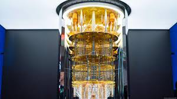
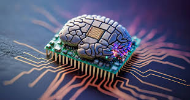
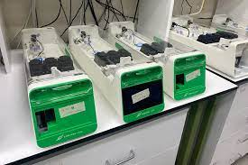

# Tarea_2
# 📘 Computación Cuántica

## 🔹 1. ¿Qué es la Computación Cuántica?
La **computación cuántica** es un área de la informática que utiliza los principios de la **mecánica cuántica** para procesar información.  
A diferencia de las computadoras clásicas que usan **bits** (0 o 1), las computadoras cuánticas usan **qubits**, que pueden estar en **superposición** (0 y 1 al mismo tiempo).  
Esto permite resolver ciertos problemas de forma mucho más rápida que los ordenadores tradicionales.

---

## 🔹 2. Arquitectura de un Computador Cuántico
Un computador cuántico está compuesto por varias partes:

- 🧩 **Qubits**: unidad básica de información cuántica.  
- ⚡ **Procesador cuántico**: donde se realizan las operaciones cuánticas.  
- 🔐 **Puertas cuánticas**: equivalentes a las puertas lógicas clásicas, manipulan qubits.  
- ❄️ **Sistemas de enfriamiento criogénico**: necesarios para mantener los qubits estables (cerca del cero absoluto).  
- 🖥️ **Control clásico**: hardware y software clásico que administra la comunicación con el procesador cuántico.  
- 👩‍💻 **Interfaz de usuario**: donde los científicos programan algoritmos cuánticos.  

---

## 🔹 3. Historia de la Computación Cuántica
- **1980s**: Richard Feynman y David Deutsch propusieron la idea de computadoras cuánticas.  
- **1994**: Peter Shor desarrolla el algoritmo de factorización cuántica.  
- **2001**: IBM logra implementar el algoritmo de Shor en un sistema de 7 qubits.  
- **2019**: Google anuncia la “supremacía cuántica” con su procesador *Sycamore* de 53 qubits.  
- **Hoy en día**: empresas como IBM, Google, Microsoft, D-Wave, IonQ y Rigetti desarrollan sistemas más potentes.  

### ✅ Ventajas:
- Resolución rápida de problemas complejos.  
- Mejor optimización en logística, química, inteligencia artificial.  
- Seguridad avanzada (nuevos métodos criptográficos).  

### ❌ Desventajas:
- Muy costosos y difíciles de mantener.  
- Alta sensibilidad al ruido y la decoherencia.  
- Aún en etapa experimental, no reemplazan a las computadoras clásicas.  

---

## 🔹 4. Conceptos Fundamentales

- **Superposición** → un qubit puede estar en 0 y 1 simultáneamente.  
- **Entrelazamiento** → relación cuántica entre qubits que permite transmitir información correlacionada.  
- **Interferencia cuántica** → se usa para amplificar probabilidades de resultados correctos y cancelar los erróneos.  
- **Medición probabilística** → al medir un qubit, su estado colapsa en 0 o 1 según probabilidades.  
- **Decoherencia** → pérdida de información cuántica por interacción con el entorno.  
- **Tipos de comunicación cuántica**: teletransportación cuántica, criptografía cuántica (QKD).  
- **Compuertas cuánticas**:  
  - `X` (NOT cuántica)  
  - `H` (Hadamard)  
  - `CNOT`  
  - `T`, entre otras.  

---
## 📘 Computación Neuromórfica
## 🔹 1. ¿Qué es un Computador Neuromórfico?

Un computador neuromórfico es un sistema diseñado para imitar la forma en que funciona el cerebro humano, tanto en la arquitectura de hardware como en el procesamiento de información.
Utiliza redes neuronales artificiales implementadas en hardware especializado que consumen muy poca energía y son muy eficientes en tareas como visión artificial, reconocimiento de patrones y aprendizaje autónomo.

## 🔹 2. Arquitectura y Funcionamiento

La arquitectura neuromórfica está inspirada en el sistema nervioso biológico.

## Componentes principales:

-  **Neuronas artificiales** →  unidades de cómputo que procesan señales.

-**Sinapsis electrónicas** →  conexiones que ajustan la transmisión de señales (similar al aprendizaje).

-**Spikes (impulsos eléctricos)** →  la información se transmite como pulsos discretos, imitando el sistema nervioso.

## Funcionamiento:

Procesa la información de manera paralela y distribuida, al igual que el cerebro.

Emplea comunicación basada en eventos (spike-based), lo que reduce el consumo energético.

### Ventajas:
-✅ Alta eficiencia energética.
-✅ Capacidad de aprendizaje autónomo.
-✅ Ideal para tareas de IA en tiempo real.
-✅ Escalabilidad para sistemas masivos.

### Desventajas:
-❌ Tecnología en desarrollo, no está madura.
-❌ Difícil de programar (no usa los lenguajes clásicos).
-❌ Hardware especializado y costoso.
-❌ No sustituye aún a los computadores tradicionales.

## 🔹 3. Hardware utilizado en la Computación Neuromórfica

-Existen varios chips neuromórficos desarrollados por diferentes empresas y laboratorios:

-IBM TrueNorth (2014): chip con 1 millón de neuronas y 256 millones de sinapsis.

-Intel Loihi (2017): chip neuromórfico con capacidad de aprendizaje autónomo en hardware.

-SpiNNaker (Univ. de Manchester): arquitectura que simula el comportamiento de millones de neuronas.

-BrainScaleS (Heidelberg Univ.): plataforma para estudiar la plasticidad sináptica.

## 🔹 4. Tipos de Computación Neuromórfica

**Basada en simulaciones digitales:**
Usa hardware tradicional pero simula el comportamiento neuronal (más lenta, pero flexible).

**Basada en chips neuromórficos dedicados:**
Hardware diseñado específicamente con neuronas y sinapsis electrónicas. Ejemplo: Loihi, TrueNorth.

**Basada en memristores y dispositivos emergentes:**
Tecnologías que permiten que la memoria y el procesamiento ocurran en el mismo lugar (similar al cerebro)

---
# 📘 Computación No Convencional (Puntos 3, 4 y 5)

---

## 🔶 3. Ordenador Biológico

### 🔹 ¿Qué es un ordenador biológico?
Un **ordenador biológico** utiliza **sistemas vivos o moléculas biológicas** (como ADN, ARN o proteínas) para procesar información.  
Se basa en la biología molecular y la biotecnología para ejecutar cálculos y resolver problemas.  

### 🔹 Arquitectura y Tipos
- **Computación basada en ADN:** utiliza cadenas de ADN para almacenar y procesar información (Leonard Adleman, 1994).  
- **Computación con proteínas:** emplea proteínas para realizar interacciones moleculares que representen operaciones lógicas.  
- **Computación celular:** usa células vivas modificadas genéticamente para realizar cálculos.  

### 🔹 Principales Hitos
- **1994:** Leonard Adleman resuelve un problema matemático con ADN.  
- **2002:** Creación de la primera "compuerta lógica" dentro de una célula viva.  
- **2017:** Investigaciones sobre biocomputación para diagnóstico médico y biología sintética.  

### ✅ Ventajas
- Alta densidad de información (1 gramo de ADN puede almacenar hasta 215 PB).  
- Posibilidad de integración con procesos biológicos.  
- Bajo consumo energético.  

### ❌ Desventajas
- Velocidad de procesamiento baja comparada con sistemas electrónicos.  
- Alta complejidad experimental.  
- Tecnología en fase de laboratorio.  

---

## 🟩 4. Computación Heterogénea

### 🔹 ¿Qué es?
La **computación heterogénea** combina distintos tipos de procesadores en un mismo sistema (CPU, GPU, FPGA, ASICs, TPUs) para aprovechar lo mejor de cada uno en tareas específicas.  

### 🔹 Historia
- **Década de 2000:** auge del uso de GPUs para acelerar gráficos y cálculos científicos.  
- **2010s:** integración de FPGAs y ASICs en servidores y dispositivos de IA.  
- **Hoy en día:** se usa ampliamente en centros de datos, inteligencia artificial, big data y simulaciones.  

### ✅ Ventajas
- Mejor rendimiento en aplicaciones específicas.  
- Mayor eficiencia energética.  
- Permite aprovechar arquitecturas especializadas.  

### ❌ Desventajas
- Mayor complejidad de programación.  
- Requiere software especializado (CUDA, OpenCL, etc.).  
- Costos de integración y mantenimiento.  

---

## ⚫ 5. Computación de Borde (Edge Computing)

### 🔹 ¿Qué es?
La **computación de borde** es un paradigma donde el procesamiento de datos ocurre **cerca de la fuente** que los genera (sensores, IoT, dispositivos móviles) en lugar de depender de servidores en la nube.  

### 🔹 Historia
- **2000s:** inicio con redes de telecomunicaciones y dispositivos móviles.  
- **2010s:** auge con el Internet de las Cosas (IoT).  
- **Hoy en día:** adoptada en 5G, ciudades inteligentes, autos autónomos, salud conectada.  

### ✅ Ventajas
- Menor latencia (procesamiento en tiempo real).  
- Menor consumo de ancho de banda.  
- Más seguridad y privacidad (los datos no siempre salen del dispositivo).  
- Ideal para aplicaciones críticas como autos autónomos, medicina o fábricas inteligentes.  

### ❌ Desventajas
- Limitaciones en capacidad de cómputo en los dispositivos.  
- Complejidad de gestión en redes distribuidas.  
- Posibles vulnerabilidades de seguridad física en dispositivos de borde.  

---

